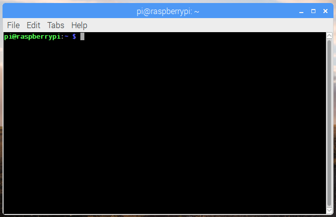

# Updating and Upgrading Raspbian

To update software in Raspbian, you'll need to use the [apt](../linux/software/apt.md) tool in a terminal window. Open the terminal from the taskbar or application menu:



First, **update** your system's package list by entering the following command:

```bash
sudo apt-get update
```

Next, **upgrade** all your installed packages to their latest versions with the command:

```bash
sudo apt-get dist-upgrade
```

Generally speaking, doing this regularly will keep your installation up to date, in that it will be equivalent to the latest released image available from [raspberrypi.org/downloads](https://www.raspberrypi.org/downloads/).

However, there are occasional changes made in the Foundation's Raspbian image that require manual intervention, for example a newly introduced package. These are not installed with an upgrade, as this command only updates the packages you already have installed.

## Updating the kernel and firmware

The kernel and firmware are installed as a Debian package, and so will also get updates when using the procedure above. These packages are updated infrequently and after extensive testing.

## Running out of space

When running `sudo apt-get dist-upgrade`, it will show how much data will be downloaded and how much space it will take up on the SD card. It's worth checking with `df -h` that you have enough disk space free, as unfortunately `apt` will not do this for you. Also be aware that downloaded package files (`.deb` files) are kept in `/var/cache/apt/archives`. You can remove these in order to free up space with `sudo apt-get clean`.
